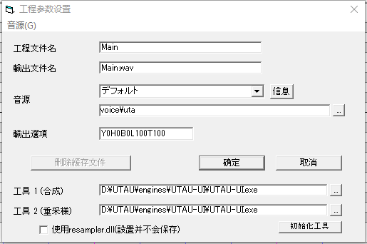

# UTAU-UI
A GUI UTAU Engine progress

[](https://ci.appveyor.com/project/GloomyGhost-MosquitoCoil/utau-ui)

## 使用说明


将resampler与wavtool设置为UTAU-UI即可

## 设置文件

```xml
<config>
	<options>
		<resampler-mode>exe</resampler-mode><!--选择resampler调用方式(dll/exe)。注意：使用exe调用后就无法使用扩展oto功能了-->
		<resampler>{0}resampler.exe</resampler><!--resampler的路径 path of resampler engine {0} means the path of UTAU-UI-->
		<wavtool>{0}wavtool.exe</wavtool><!--wavtool的路径 path of synthese engine-->
		<multi-thread>true</multi-thread><!--是否使用多线程合成 use multi thread synthese (true/false)-->
		<thread-num>4</thread-num><!--多线程合成的线程数量 the number of threads-->
		<show-console>false</show-console><!--是否显示cmd输出窗口 Show cmd window (true/false)-->
		<language>auto</language><!--语言设定 language setting [e.g. auto(跟随系统 following system)/zh-CN/jp/en-US]-->
	</options>
</config>
```
## 下载

[下载页面](https://github.com/umuism/UTAU-UI/releases)
